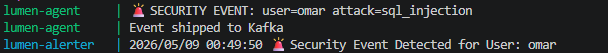
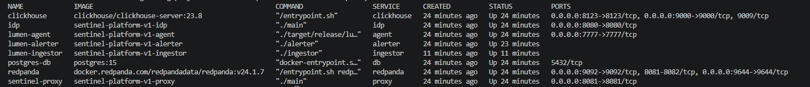
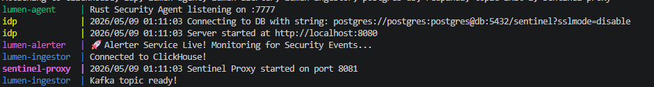
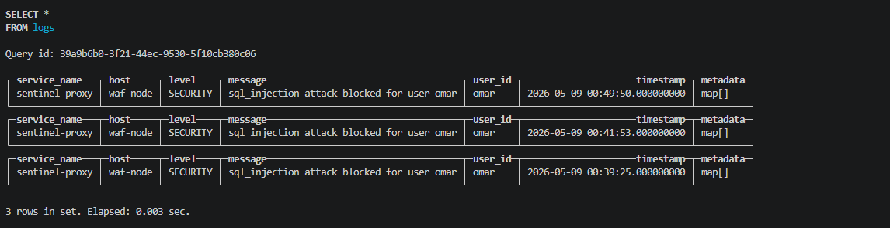

# Sentinel Platform v1

Distributed security observability pipeline built with Go, Rust, Kafka-compatible streaming, ClickHouse, and Docker.

Sentinel Platform is a real-time event-driven system designed to simulate how modern security infrastructure detects, processes, transports, and stores security telemetry across distributed services.

The platform demonstrates cross-language backend engineering, asynchronous event pipelines, distributed systems orchestration, and security-focused architecture.

---

# Architecture Overview

The system is composed of multiple independent services communicating through Kafka-compatible event streaming using Redpanda.

## Core Services

| Service | Language | Purpose |
|---|---|---|
| Sentinel Proxy | Go | Reverse proxy + WAF security layer |
| Lumen Agent | Rust | Security event collector and Kafka producer |
| Lumen Ingestor | Go | Kafka consumer + ClickHouse ingestion pipeline |
| Lumen Alerter | Go | Real-time security event monitoring |
| IDP Service | Go | Identity/authentication simulation service |
| Redpanda | Kafka API | Event streaming backbone |
| ClickHouse | Database | High-performance analytics storage |
| PostgreSQL | Database | Identity provider persistence |

---

# Event Flow

```text
Incoming Request
        ↓
Sentinel Proxy (WAF Detection)
        ↓
Rust Security Agent
        ↓
Redpanda / Kafka Event Bus
        ↓
Go Ingestor Service
        ↓
ClickHouse Analytics Storage
        ↓
Real-Time Alerting Service
```

---

# Features

- Real-time security event ingestion
- Event-driven distributed architecture
- Kafka-compatible streaming with Redpanda
- ClickHouse analytics persistence
- Dockerized multi-service deployment
- WAF-style attack detection
- Protobuf-based event serialization
- Cross-language service communication
- Graceful startup orchestration handling
- Real-time alert monitoring

---

# Technologies Used

## Backend
- Go
- Rust

## Infrastructure
- Docker
- Docker Compose
- Redpanda
- Kafka Protocol
- ClickHouse
- PostgreSQL

## Data & Messaging
- Protocol Buffers
- Kafka Event Streaming

---

# Security Events

The platform simulates real-time security telemetry flowing through a distributed event-driven pipeline.

Current simulated detections include:

- SQL Injection Detection
- Request Blocking
- Security Alert Generation
- Event Streaming
- Real-Time Monitoring
- Persistent Analytics Storage

## Live Security Event Detection



The Rust security agent detects attack activity and publishes structured events into the Kafka-compatible streaming pipeline, where they are consumed by downstream monitoring and analytics services.

---

# Engineering Challenges

One issue encountered during development was distributed service startup ordering inside Docker Compose.

The ingestion service occasionally initialized before Kafka topics were fully created, causing temporary consumer failures during startup.

This was resolved by implementing Kafka topic readiness checks and retry logic inside the ingestion service, allowing the platform to self-recover automatically without requiring manual container restarts.

This improved platform resiliency and orchestration reliability.

---

# Screenshots

## Distributed Services Running

ADD IMAGE HERE

```md

```

---

## Security Event Detection

ADD IMAGE HERE

```md

```

---

## ClickHouse Event Persistence

ADD IMAGE HERE

```md

```

---

# Running the Platform

## Clone Repository

```bash
git clone <repo-url>
cd sentinel-platform-v1
```

## Start Services

```bash
docker compose up --build
```

---

# Testing Security Events

Send a simulated attack event:

## PowerShell

```powershell
Invoke-RestMethod -Method POST `
  -Uri "http://localhost:7777/event" `
  -ContentType "application/json" `
  -Body '{"user_id":"omar","attack_type":"sql_injection","action":"blocked"}'
```

---

# Example Output

## Agent

```text
🚨 SECURITY EVENT: user=omar attack=sql_injection
Event shipped to Kafka
```

## Ingestor

```text
Connected to ClickHouse!
Kafka topic ready!
Lumen Ingestor Live! Processing logs...
```

## Alerter

```text
Security Event Detected for User: omar
```

---

# ClickHouse Verification

```sql
USE lumen_db;

SELECT * FROM logs;
```

Example stored event:

```text
service_name : sentinel-proxy
host         : waf-node
level        : SECURITY
message      : sql_injection attack blocked for user omar
user_id      : omar
```

---

# Project Goals

This project was built to explore:

- Distributed systems engineering
- Event-driven architectures
- Security observability pipelines
- Cross-language backend systems
- Real-time streaming infrastructure
- High-performance analytics storage
- Container orchestration

---

# Future Improvements

- Dashboard UI
- Metrics aggregation
- Threat scoring
- Rate limiting engine
- Multi-node Kafka deployment
- Authentication middleware
- Kubernetes deployment
- SIEM integrations
- OpenTelemetry support

---

# Status

Sentinel Platform v1 is fully operational and demonstrates an end-to-end distributed security event pipeline with persistent analytics storage and real-time monitoring.