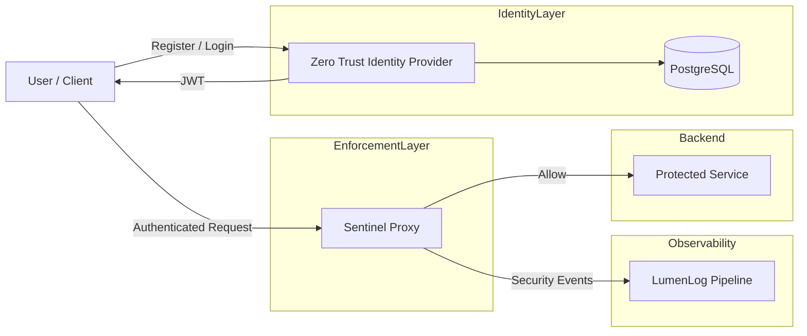

# Sentinel Platform v0


## Category

Security Engineering / Distributed Systems

---

# Overview

Sentinel Platform v0 is a zero-trust security platform built around identity enforcement, request validation, and edge-layer protection.

The system separates authentication from enforcement by using an independent Identity Provider and a dedicated security proxy. Every request is validated before reaching protected services.

This version focuses on:

* passkey-based authentication
* JWT identity propagation
* reverse proxy enforcement
* Web Application Firewall (WAF) protections
* rate limiting
* structured security telemetry
* integration with the LumenLog event pipeline

The project demonstrates how authentication, authorization, and request security can operate together in a production-style architecture.

---

# Core Idea

Every request must prove its identity before it is trusted.

Sentinel Platform follows a zero-trust model where:

* identity is verified independently
* authorization is enforced at the edge
* requests are inspected before forwarding
* malicious traffic is blocked early
* security events are emitted as structured telemetry

Rather than treating authentication and security as isolated features, the platform combines them into a connected request enforcement pipeline.

---

# System Architecture



---

# Architecture Components

## Zero Trust Identity Provider

Authentication service responsible for identity creation and session management.

Responsibilities:

* WebAuthn passkey registration
* passwordless authentication
* JWT access token issuance
* refresh token lifecycle management
* session persistence in PostgreSQL

---

## Sentinel Proxy

Security enforcement gateway positioned in front of protected services.

Responsibilities:

* reverse proxy routing
* JWT validation
* role-based access control
* request inspection
* WAF filtering
* rate limiting
* structured security event generation

The proxy acts as the primary enforcement layer of the system.

---

## LumenLog Integration

Sentinel Platform emits structured telemetry events into LumenLog.

Events include:

* blocked attacks
* authentication activity
* rate-limit violations
* unauthorized access attempts
* request metadata

This creates real-time observability for security events across the platform.

---

# Request Flow

1. User authenticates through the Identity Provider
2. Identity Provider issues JWT access token
3. Client sends request through Sentinel Proxy
4. Proxy validates identity and permissions
5. WAF and rate-limiter inspect the request
6. Request is either:
   * forwarded to backend
   * blocked at the edge
7. Structured telemetry event emitted to LumenLog

---

# Core Features

## Passkey Authentication

* passwordless WebAuthn login
* phishing-resistant authentication
* hardware-backed credentials
* browser-native passkey support

---

## JWT-Based Identity

* stateless access verification
* short-lived access tokens
* role propagation through JWT claims
* proxy-side identity enforcement

---

## Refresh Token Lifecycle

* refresh tokens persisted in PostgreSQL
* hashed before storage
* renewable sessions without re-authentication
* server-side session invalidation support

---

## Web Application Firewall (WAF)

Detects and blocks suspicious request patterns.

Current protections include:

* SQL injection detection
* XSS pattern detection
* malicious query inspection
* suspicious payload filtering

Requests are blocked before reaching backend services.

---

## Rate Limiting

* per-IP request limiting
* brute-force protection
* automated abuse reduction
* edge-layer traffic enforcement

---

## Role-Based Access Control

Routes are protected directly at the proxy layer.

Examples:

* admin-only endpoints
* user-restricted APIs
* token-based route authorization

Unauthorized traffic is rejected before backend access.

---

## Structured Security Telemetry

Security events are emitted for:

* blocked requests
* successful authentication
* failed authorization
* attack detection
* rate-limit violations

Telemetry is forwarded into the LumenLog pipeline for storage and alerting.

---

# Example Security Event

```text
🚨 SECURITY ALERT

User: bob
Service: sentinel-proxy
Attack: SQL Injection
Action: blocked
Path: /login
IP: 192.168.x.x
```

---

# Example Flows

## Allowed Request

```bash
curl -H "Authorization: Bearer <token>" http://localhost:8081/api/user
```

Result:

```text
200 OK
```

---

## Unauthorized Admin Access

```bash
curl -H "Authorization: Bearer <user_token>" http://localhost:8081/api/admin
```

Result:

```text
403 Forbidden
```

---

## Malicious Request

```bash
curl "http://localhost:8081/?q=' OR 1=1 --"
```

Result:

```text
Blocked by WAF
```

---

# Project Structure

## Identity Provider

* `/handlers` → authentication and token flows
* `/db` → PostgreSQL integration
* `/static` → login and testing frontend

---

## Sentinel Proxy

* `/proxy` → reverse proxy routing
* `/middleware` → WAF and rate limiting
* `/events` → security telemetry emission
* `/config` → environment configuration

---

# Running the Platform

## Prerequisites

* Docker
* Docker Compose

---

## Start the System

```bash
docker compose up --build
```

---

## Stop the System

```bash
docker compose down
```

---

## Fresh Reset

```bash
docker compose down -v
```

---

# Services

| Service | Port |
|---|---|
| Identity Provider | 8080 |
| Sentinel Proxy | 8081 |
| PostgreSQL | 5432 |

---

# Quick Test

## Open Browser

```text
http://localhost:8080
```

Register a passkey and authenticate.

---

## Test Proxy

```bash
curl http://localhost:8081
```

---

## Test SQL Injection Detection

```bash
curl "http://localhost:8081/?q=' OR 1=1 --"
```

---

## Test XSS Detection

```bash
curl "http://localhost:8081/?q=<script>alert(1)</script>"
```

---

# Tech Stack

* Go
* WebAuthn
* JWT
* PostgreSQL
* Docker
* Reverse Proxy (net/http)
* Protobuf
* Redpanda
* ClickHouse

---

# What This Project Demonstrates

This project demonstrates:

* zero-trust architecture
* edge-layer request enforcement
* custom reverse proxy security design
* passkey authentication systems
* JWT identity propagation
* WAF implementation
* rate-limiting systems
* distributed telemetry pipelines
* event-driven security observability
* containerized distributed services

---

# Closing Note

Sentinel Platform v0 is an experimental zero-trust enforcement platform focused on identity-aware request security and telemetry generation.

The project explores how authentication, edge protection, and observability can work together as one connected security system.