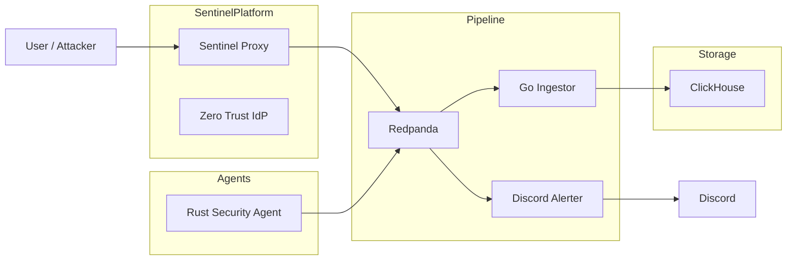

# LumenLog

## Category

Distributed Systems / Security Engineering

---

## Overview

LumenLog is a distributed observability and security event pipeline designed to collect, process, persist, and alert on system activity in real time.

The platform combines multiple services written in Go and Rust into a unified telemetry architecture capable of handling both infrastructure logs and security events.

Originally focused on distributed logging, the project evolved into a lightweight security operations pipeline through direct integration with Sentinel Platform.

LumenLog now supports:

* real-time security alerting
* identity-aware event tracking
* Discord webhook notifications
* centralized event persistence
* cross-service observability
* distributed event streaming

The project demonstrates how telemetry, security enforcement, and event processing can work together in a production-style backend architecture.

---

## Core Idea

Every system generates events.

LumenLog treats those events as a continuous stream that can be:

* collected
* enriched
* streamed
* filtered
* persisted
* queried
* alerted on in real time

Instead of storing logs independently inside each service, LumenLog centralizes events into a distributed processing pipeline.

---

## System Architecture



---

## Architecture Components

## Rust Security Agent

A lightweight telemetry producer written in Rust.

Responsibilities:

* generate structured security events
* serialize logs using Protobuf
* publish messages into Redpanda
* simulate distributed telemetry producers

---

## Sentinel Security Bridge

Sentinel Proxy acts as a security event producer.

Responsibilities:

* emit WAF detection events
* emit blocked request events
* emit rate-limit violations
* attach authenticated identity metadata
* forward structured events into the pipeline

This transforms LumenLog from a logging platform into a security-aware observability system.

---

## Redpanda Broker

Kafka-compatible event streaming backbone.

Responsibilities:

* receive events from producers
* buffer event streams
* distribute messages to consumers
* decouple producers from downstream systems
* support scalable asynchronous processing

---

## Go Ingestor

Consumes Protobuf messages from Redpanda.

Responsibilities:

* decode Protobuf event payloads
* normalize event metadata
* batch database writes
* persist events into ClickHouse

The ingestor acts as the bridge between distributed streaming and long-term analytical storage.

---

## Discord Alerter

Real-time security alerting sidecar.

Responsibilities:

* monitor incoming security events
* suppress noise from normal traffic
* trigger Discord notifications only for malicious activity
* provide immediate operational visibility

---

## ClickHouse Storage

Column-oriented analytical database used for persistence.

Responsibilities:

* store structured telemetry
* persist security events
* support fast querying
* enable future dashboards and analytics
* provide centralized observability storage

---

## Security Event Flow

### Example Attack Flow

1. User sends malicious request to Sentinel Proxy
2. WAF detects suspicious behavior
3. Proxy emits structured SECURITY event
4. Event streamed through Redpanda
5. Discord Alerter triggers notification
6. Ingestor stores event inside ClickHouse

---

## Example Discord Alert

```text
🚨 SECURITY ALERT

User: bob
Service: sentinel-proxy
Attack: SQL Injection
Action: blocked
Path: /login
IP: 192.168.x.x
```

---

## Core Features

## Real-Time Security Alerting

* Discord webhook integration
* immediate attack notifications
* intelligent filtering to reduce noise
* centralized security visibility

---

## Identity-Aware Logging

Security events can include:

* authenticated username
* anonymous traffic tagging
* service metadata
* attack classification
* enforcement actions

This creates a lightweight audit trail across services.

---

## Distributed Event Streaming

* asynchronous architecture
* decoupled producers and consumers
* Kafka-compatible transport
* scalable ingestion pipeline

---

## Polyglot System Design

The platform intentionally combines:

* Rust producers
* Go backend services
* Protobuf schemas
* Kafka-compatible infrastructure
* analytical storage systems

This demonstrates interoperability between different languages and distributed services.

---

## Structured Security Telemetry

Current event types include:

* SQL injection attempts
* XSS attempts
* blocked admin access
* rate-limit violations
* authentication activity
* suspicious request detection

---

## Containerized Infrastructure

The full platform runs through Docker Compose.

Services can be launched together using a single command.

---

## Database Schema

## lumen_db.logs

| Column | Type |
|---|---|
| service_name | String |
| host | String |
| level | String |
| message | String |
| user_id | String |
| timestamp | DateTime64 |
| metadata | String |

---

## Running the System

## Prerequisites

* Docker
* Docker Compose

---

## Start Sentinel Platform

LumenLog integrates with Sentinel Platform for security event generation.

Start Sentinel Platform first:

```bash
docker compose up --build
```

Sentinel services:

* Sentinel Proxy
* Zero Trust Identity Provider
* PostgreSQL

---

## Start LumenLog

From the LumenLog project directory:

```bash
docker compose up --build
```

This launches:

* Rust Security Agent
* Redpanda
* Go Ingestor
* Discord Alerter
* ClickHouse

---

## Stop the Stack

```bash
docker compose down
```

---

## Full Reset

```bash
docker compose down -v
```

---

## Verifying Events

### View Kafka Events

```bash
docker exec -it lumenlog-redpanda-1 rpk topic consume security-events
```

---

### View Stored ClickHouse Logs

```bash
docker exec -it clickhouse clickhouse-client --password lumenlog2026
```

Then:

```sql
USE lumen_db;
SELECT * FROM logs;
```

---

## Current Integration Status

LumenLog currently integrates with:

* Sentinel Proxy
* Zero Trust Identity Provider
* Discord webhook notifications
* ClickHouse analytics storage

This version focuses on distributed security telemetry and observability independently from Sentinel OS.

Future versions are planned to integrate directly into the Sentinel OS dashboard for live visualization, analytics, and centralized monitoring.

---

## Tech Stack

* Go
* Rust
* Redpanda
* ClickHouse
* Docker
* Protobuf
* Discord Webhooks
* Kafka Protocol

---

## What This Project Demonstrates

This project demonstrates:

* distributed event streaming
* real-time observability pipelines
* security telemetry engineering
* asynchronous service communication
* structured logging architecture
* polyglot distributed systems
* identity-aware monitoring
* production-style containerized infrastructure

---

## Closing Note

LumenLog started as a distributed logging experiment and evolved into a security-focused observability pipeline.

The project demonstrates how security systems, event streaming, telemetry infrastructure, and identity-aware services can operate together as one connected architecture instead of isolated components.